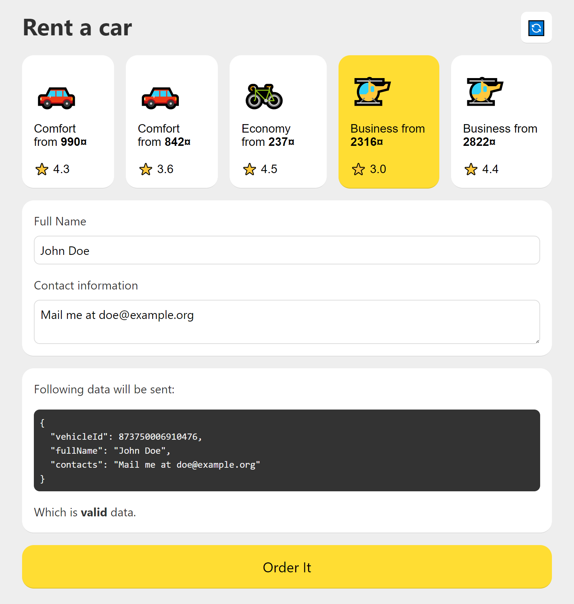

# 🛠️ Just Monorepo

> Outdated
>
> This project uses outdated technologies and is not recommended for use in modern development.

Minimal monorepo boilerplate featuring NPM Workspaces along with webpack and TypeScript.

  - See [specs](./docs/specs.md) for project sample business processes
  - See [how-to](./docs/howto.md) for guide to set up monorepo like this

## Features

  - Monorepository using NPM workspaces
  - TypeScript support for all sub-packages
  - [Express backend](packages/server) and [React frontend](packages/client), both live-reloadable

## Usage

Clone this repository:

```sh
git clone https://github.com/icmx/just-monorepo
```

Go to local saved copy:

```sh
cd just-monorepo
```

Install dependencies:

```sh
npm install
```

Build packages:

```sh
npm run build
```

One can also build a specific package, e.g. `npm run build:client`.

Run live-reload for applications packages:

```sh
npm run watch:client
npm run watch:server
```

*Note:* client application requires server application running. They can be started together on separate terminals e.g.

## How it looks like?

This project isn't about UI, but in case you need to see it, here it is:



## Motivation

There are lots of similar boilerplates already indeed. However, most of them are incredibly bloated by endless dependencies, which may be deprecated, outdated and not even used at all, thus I suppose there should be some really lightweight and easy to use alternative.

Please note that packages choice for Just Monorepo not only bare, but also sane — this project is not about making it as small as possible.

## Structure

Project structure is described in [how-to](./docs/howto.md).

## See Also

  - [Just Gulp](https://github.com/icmx/just-gulp) — same project, but much smaller and for bundling frontend application by using gulp.
  - [Just Webpack](https://github.com/icmx/just-webpack) — same, but for Webpack.
